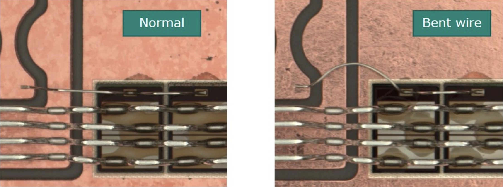
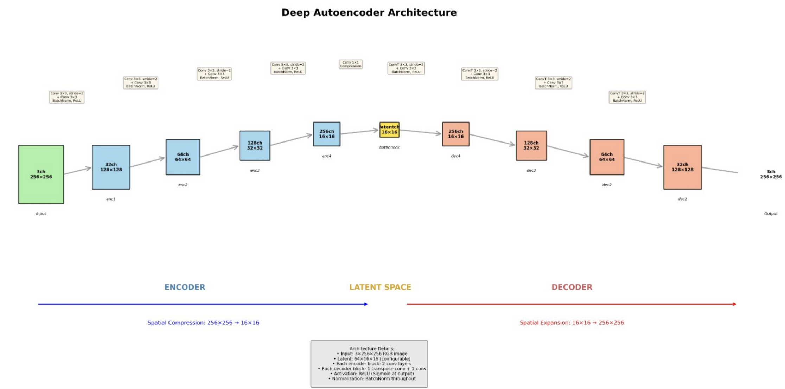
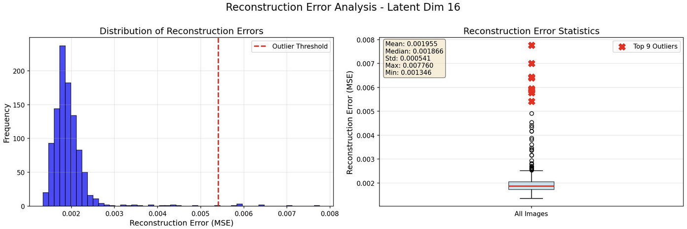
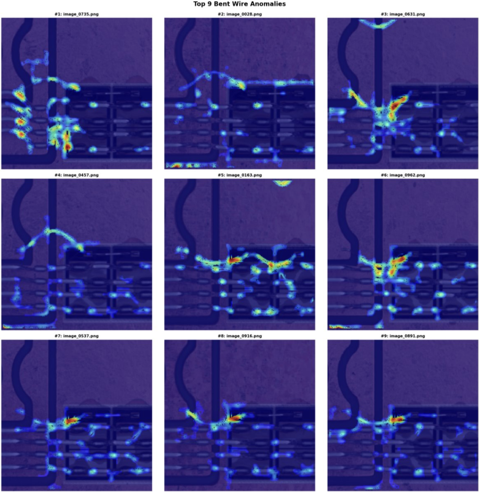
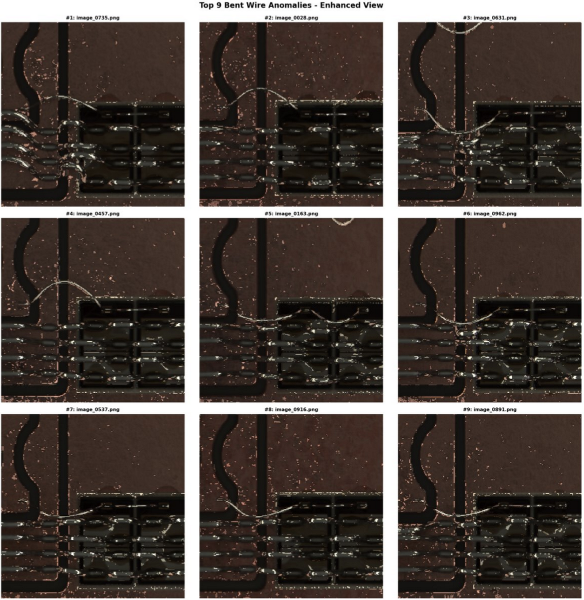

# 🏆 Infineon Hackathon 2025 - Bent Wire Detection (Winner)

[](https://www.python.org/downloads/)
[](https://pytorch.org/)
[](LICENSE)

**Winner of the Infineon Hackathon - October 2nd, 2025**

An unsupervised deep learning solution for detecting bent wires in semiconductor manufacturing using autoencoder-based anomaly detection.

---

## 📋 Table of Contents

- [Overview](#overview)
- [The Challenge](#the-challenge)
- [Our Solution](#our-solution)
- [Results](#results)
- [Installation](#installation)
- [Usage](#usage)
- [Technical Details](#technical-details)
- [Team](#team)

---

## Overview

This project was developed during the Infineon Hackathon in Warstein, Germany, where we tackled a real-world quality control challenge in semiconductor manufacturing. Our solution successfully identified bent wires in high-power semiconductor modules used in electric vehicles and wind turbines.

### Context

Infineon's Warstein facility specializes in back-end semiconductor manufacturing, where microchips are integrated into usable modules through wire bonding processes. The quality of these wire connections is **critical** - a single wire failure could prevent an electric car from driving. Our task was to identify bent wires that could potentially cause electrical short-circuits.


*Left: Normal wire connection | Right: Bent wire anomaly*

---

## The Challenge

### Problem Statement

- **Dataset**: 1,000 high-resolution images of wire bond regions
- **Constraint**: No labeled data (unsupervised learning required)
- **Objective**: Identify bent wires among various anomaly types (color changes, dark spots, etc.)
- **Scalability**: Solution must work for millions of images in production

### Requirements

1. ✅ Develop an unsupervised computer vision approach
2. ✅ Generate heatmaps showing anomalous regions
3. ✅ Compile a shortlist of critical images with bent wires
4. ✅ Ensure scalability for production deployment

---

## Our Solution

We developed a **Deep Convolutional Autoencoder** with advanced post-processing to detect bent wires with high precision.

### Architecture


*Deep Convolutional Autoencoder with 4-level encoder-decoder structure and 64-dimensional latent space*

### Key Features

1. **Deep Autoencoder Architecture**
   - 4-level encoder-decoder with batch normalization
   - 64-dimensional latent space for efficient representation
   - MSE reconstruction loss

2. **Multi-Scale Error Analysis**
   - Fine-grained detection (σ=1.5) for precise localization
   - Coarse detection (σ=3.5) for context
   - Combined masking for robust detection

3. **Geometric Filtering**
   - Aspect ratio analysis (>8:1 for wire-like structures)
   - Orientation filtering (horizontal wires)
   - Solidity threshold (>0.85 for straight wires)

4. **Edge-Based Refinement**
   - Sobel edge detection to confirm wire presence
   - Reduces false positives from color variations

---

## Results

Our solution successfully identified bent wires with high accuracy while filtering out other anomaly types.

### Reconstruction Error Analysis


*Distribution of reconstruction errors across all images with outlier detection (left) and statistical box plot showing top 9 anomalies (right)*

### Anomaly Detection Results


*Statistical analysis showing detected anomalies above threshold (mean + 3σ)*

### Heatmap Visualization


*Left: Original image with bent wire overlay | Right: Raw reconstruction error heatmap*

### Top Anomalies Grid


*Top 9 detected bent wire anomalies with enhanced visualization*

### Performance Metrics

- **Images Processed**: 1,000
- **Anomalies Detected**: ~15-25 (depending on threshold)
- **Mean Reconstruction Error**: 0.001955 (MSE)
- **Outlier Threshold**: Mean + 3σ ≈ 0.0056
- **False Positive Rate**: Low (geometric filtering eliminates non-wire anomalies)
- **Processing Time**: ~2-3 seconds per image (GPU)
- **Scalability**: ✅ Fully scalable to millions of images

The reconstruction error analysis shows a clear separation between normal images (clustered around 0.002 MSE) and anomalies (outliers beyond the threshold), validating our autoencoder's ability to learn normal wire patterns.

---

## Installation

### Prerequisites

- Python 3.8 or higher
- CUDA-capable GPU (recommended) or CPU

### Setup

1. Clone the repository:
```bash
git clone https://github.com/yourusername/Infineon_Unsupervised_Anomaly_Detection.git
cd Infineon_Unsupervised_Anomaly_Detection
```

2. Create a virtual environment:
```bash
python -m venv venv
source venv/bin/activate  # On Windows: venv\Scripts\activate
```

3. Install dependencies:
```bash
pip install -r requirements.txt
```

---

## Usage

### Basic Usage

1. Place your images in a directory (e.g., `Images/`)

2. Update the image path in `src/detect_bent_wires.py`:
```python
images_dir = '/path/to/your/Images'
```

3. Run the detection:
```bash
python src/detect_bent_wires.py
```

### Output

The script generates:
- **Individual visualizations**: `bent_wires_latent64/anomaly_*.png`
- **Summary grid**: `bent_wires_latent64/summary.png`
- **Trained model**: `bent_wire_detector_latent64_epochs10.pth`

### Configuration

Adjust hyperparameters in `src/detect_bent_wires.py`:
```python
IMG_SIZE = 256          # Image resolution
BATCH_SIZE = 16         # Training batch size
EPOCHS = 10             # Training epochs
LEARNING_RATE = 0.001   # Adam optimizer learning rate
LATENT_DIM = 64         # Bottleneck dimension
```

---

## Technical Details

### Approach Rationale

1. **Why Autoencoders?**
   - Unsupervised learning (no labels required)
   - Learns normal patterns, flags deviations
   - Scalable to large datasets

2. **Why Deep Architecture?**
   - Captures hierarchical features (edges → textures → structures)
   - Better generalization than shallow models

3. **Why Geometric Filtering?**
   - Bent wires have distinct geometric properties
   - Eliminates false positives (color variations, spots)
   - Domain knowledge integration

### Algorithm Pipeline

```
1. Load & Preprocess Images (256×256, normalized)
2. Train Autoencoder (10 epochs, MSE loss)
3. Compute Reconstruction Errors
4. Statistical Thresholding (mean + 3σ)
5. Multi-Scale Gaussian Filtering
6. Geometric Property Analysis
7. Edge-Based Validation
8. Generate Heatmaps & Visualizations
```

<div align="center">
  <strong>🏆 Winner - Infineon Hackathon 2025 🏆</strong>
  <br>
  <em>Advancing Quality Control in Semiconductor Manufacturing</em>
</div>
